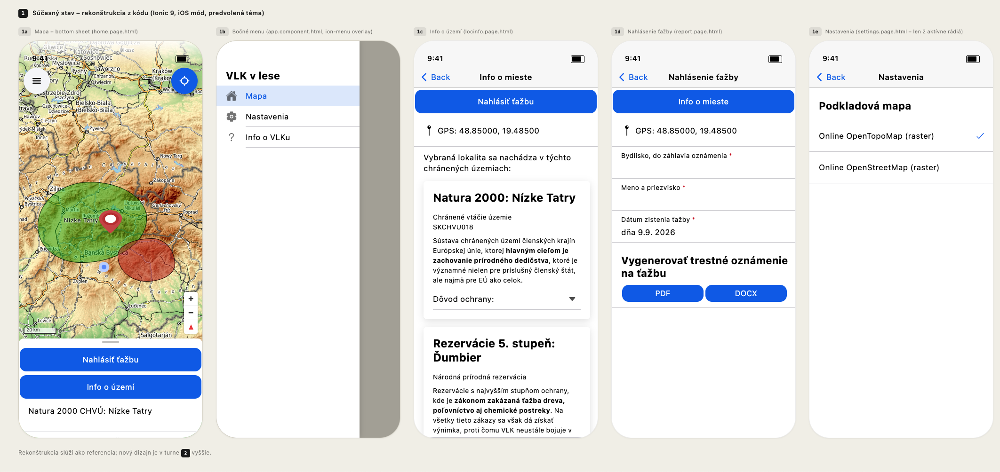

VLK je mobilná aplikácia pre iOS a Android zameraná na ochranu lesov.
Momentálne je vo vývoji. Podrobnejší prípadový príklad pribudne, keď bude aplikácia zverejnená.

## Východiskový stav

Takto aplikácia začínala: pôvodný stav, zrekonštruovaný z kódu. Mapa so spodným panelom, bočné menu, obrazovka s informáciami o území, formulár nahlásenia s exportom do PDF a DOCX a nastavenia. Funguje, ale vyzerá ako štandardná aplikácia v Ionicu: modré lišty a sivé prvky, zatiaľ bez vlastnej identity.

Redizajn skúma, ako môže identita VLK žiť v ovládacích prvkoch aplikácie, zatiaľ čo obsah ostáva biely, krémový a čitateľný na slnku.
